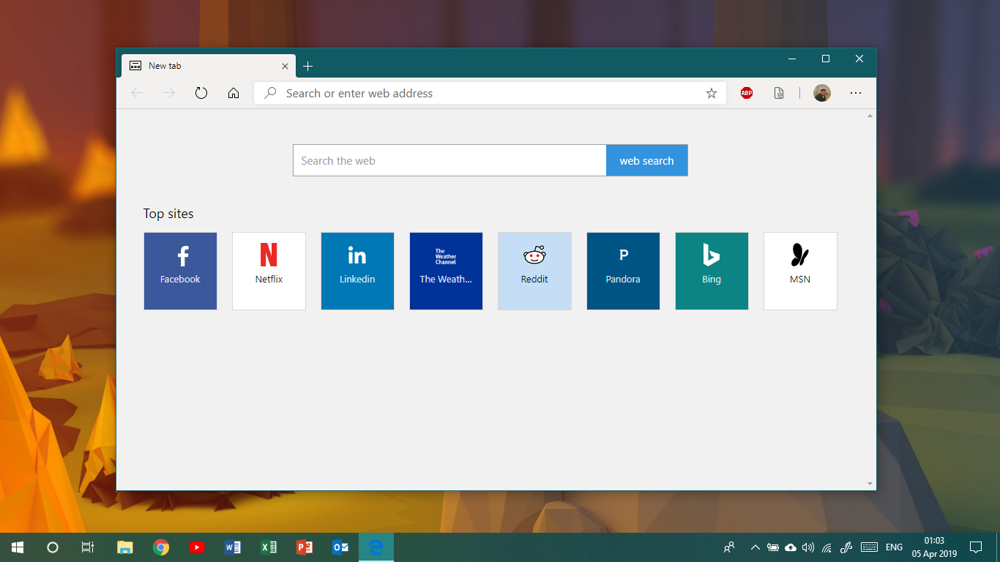

# Edge New Tab Page
Replace Chromium's default New Tab page to Microsoft Edge's New Tab page.

## Love Microsoft UWP's Edge new tab page? Bring it to Chromium-based browser!
Celebrating the Project Anaheim (which brings Chromium to Windows 10 as replacement of Spartan's Microsoft Edge) by bring back the new tab page of the old Microsoft Edge to the new one!

## How to Install
### Chrome
* Extract zip file to a new folder
* Click 3-dots button - More Tools - Extension, or go to "chrome://extension"
* Click Load unpacked
* Choose the folder of the extracted files

### Microsoft Edge (Chromium beta)
* Extract zip file to a new folder
* Click 3-dots button - Extension, or go to "edge://extension"
* Click Load unpacked
* Choose the folder of the extracted files

## Bug/Problems
* You can't change or remove the pinned tiles
* When you resize the window to small, "web search" button should be replaced to magnifier icon, but it doesn't appear

## Upcoming Features
* MSN News tiles
* Change search engine (for now, the default is Google)
* Customize pinned tiles
* User Picture and Name (customizable)

## Download
<a href="https://github.com/jordanapit/Edge-New-Tab/blob/master/Edge-new-tab-v0.1.01.zip?raw=true">Edge-new-tab-v0.1.01.zip</a>

## Screenshot

## Contribute
Well, I really need your help, guys! But, I have a few problems:
* I don't speak English as my daily language (I speak bahasa Indonesia)
* I'm new in Github

So, if you want to help me, just contact me from <a href="https://api.whatsapp.com/send?phone=+4915121234567">here</a>. Thank you!
